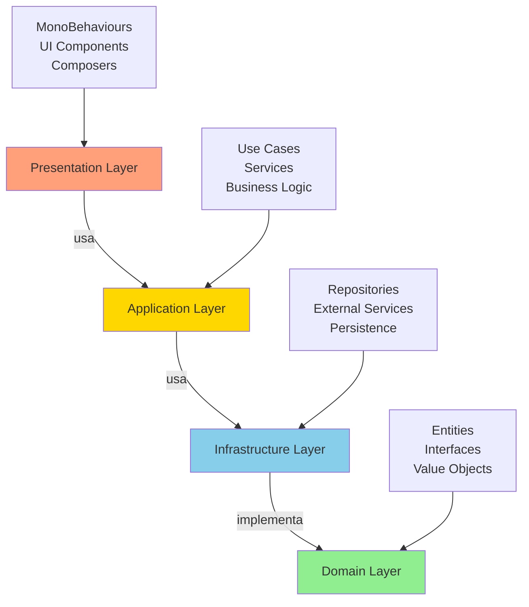

# Aplicación de Clean Architecture y SOLID en el Proyecto

## Tabla de Contenidos
1. [Introducción](#introducción)
2. [Arquitectura General](#arquitectura-general)
3. [Principios SOLID Aplicados](#principios-solid-aplicados)
4. [Patrones de Diseño Implementados](#patrones-de-diseño-implementados)
5. [Estructura de Carpetas](#estructura-de-carpetas)
6. [Sistemas Principales](#sistemas-principales)
7. [Diagrama de Dependencias](#diagrama-de-dependencias)
8. [Ejemplos de Implementación](#ejemplos-de-implementación)

---

## Introducción

Este proyecto implementa **Clean Architecture** y los principios **SOLID** para crear un sistema de juego modular, mantenible y escalable en Unity. La arquitectura separa las responsabilidades en capas claramente definidas, permitiendo que el código sea testeable, reutilizable y fácil de extender.

### Objetivos de la Arquitectura
- ✅ Separación de responsabilidades (SRP)
- ✅ Código abierto para extensión, cerrado para modificación (OCP)
- ✅ Inversión de dependencias mediante interfaces (DIP)
- ✅ Testabilidad mediante inyección de dependencias
- ✅ Bajo acoplamiento y alta cohesión

---

## Arquitectura General

El proyecto sigue una **arquitectura en capas** inspirada en Clean Architecture de Robert C. Martin:

```
┌─────────────────────────────────────────┐
│         PRESENTATION LAYER              │
│    (UI, MonoBehaviours, Composers)      │
├─────────────────────────────────────────┤
│        APPLICATION LAYER                │
│     (Use Cases, Services)               │
├─────────────────────────────────────────┤
│       INFRASTRUCTURE LAYER              │
│  (Repositories, Persistence, External)  │
├─────────────────────────────────────────┤
│          DOMAIN LAYER                   │
│      (Entities, Interfaces)             │
└─────────────────────────────────────────┘
```

### Flujo de Dependencias
Las dependencias **siempre apuntan hacia adentro**:
- **Presentation** → **Application** → **Infrastructure** → **Domain**
- El núcleo (Domain) **no depende** de capas externas
- Las capas externas **dependen de abstracciones** (interfaces) del núcleo

---

## Principios SOLID Aplicados

### 1. **S**ingle Responsibility Principle (SRP)
*Una clase debe tener una sola razón para cambiar.*

#### ✅ Ejemplos en el Proyecto:

**Antes (Violaba SRP):**
```csharp
// PlayerStatDisplay.cs - Hacía DEMASIADO
public class PlayerStatDisplay : MonoBehaviour
{
    // ❌ Responsabilidades mezcladas:
    // - Actualizar UI
    // - Buscar componentes del jugador
    // - Suscribirse a eventos
    // - Manejar lógica de negocio
}
```

**Después (Cumple SRP):**
```csharp
// Cada clase tiene UNA responsabilidad

// 1. Solo muestra datos
public class PlayerStatDisplayUI : MonoBehaviour, IPlayerStatObserver
{
    public void OnStatsChanged(PlayerStats stats) 
    { 
        UpdateUI(stats); 
    }
}

// 2. Solo maneja lógica de estadísticas
public class PlayerStatSystem : IPlayerStatProvider
{
    public PlayerStats GetCurrentStats() { /* ... */ }
    public void ModifyStat(StatType type, float value) { /* ... */ }
}

// 3. Solo coordina componentes
public class PlayerStatDisplayComposer : MonoBehaviour
{
    private PlayerStatSystem statSystem;
    private PlayerStatDisplayUI displayUI;
    // Conecta sistema con UI
}
```

### 2. **O**pen/Closed Principle (OCP)
*Abierto para extensión, cerrado para modificación.*

#### ✅ Ejemplo: Sistema de Daño

```csharp
// Interfaz base - NO se modifica
public interface IDamageStrategy
{
    void ApplyDamage(IHealth target, float damage);
}

// Implementaciones - EXTENSIÓN sin modificar código existente
public class DirectDamageStrategy : IDamageStrategy
{
    public void ApplyDamage(IHealth target, float damage)
    {
        target.TakeDamage(damage);
    }
}

public class AreaDamageStrategy : IDamageStrategy
{
    private float radius;
    public void ApplyDamage(IHealth target, float damage)
    {
        // Lógica de daño en área
        foreach (var entity in GetEntitiesInRadius(target.Position, radius))
        {
            entity.TakeDamage(damage);
        }
    }
}

// Nuevas estrategias se AGREGAN, no se MODIFICAN clases existentes
public class PoisonDamageStrategy : IDamageStrategy
{
    public void ApplyDamage(IHealth target, float damage)
    {
        // Daño con efecto de veneno
    }
}
```

### 3. **L**iskov Substitution Principle (LSP)
*Las clases derivadas deben poder sustituir a sus clases base.*

#### ✅ Ejemplo: Sistema de Personajes

```csharp
// Interfaz base
public interface ICharacterController
{
    void Initialize(CharacterConfig config);
    void Update();
    void Cleanup();
}

// Implementaciones intercambiables
public class PlayerController : ICharacterController { /* ... */ }
public class EnemyController : ICharacterController { /* ... */ }
public class NPCController : ICharacterController { /* ... */ }

// Sistema que usa LSP - funciona con CUALQUIER ICharacterController
public class CharacterSystemComposer
{
    public void RegisterCharacter(ICharacterController controller)
    {
        // Funciona con Player, Enemy o NPC
        controller.Initialize(config);
    }
}
```

### 4. **I**nterface Segregation Principle (ISP)
*Los clientes no deben depender de interfaces que no usan.*

#### ✅ Ejemplo: Interfaces Segregadas

**Antes (Violaba ISP):**
```csharp
// ❌ Interfaz gigante - no todos necesitan todo
public interface ICharacter
{
    void Move();
    void Attack();
    void TakeDamage(float damage);
    void Heal(float amount);
    void UseAbility();
    void Trade(Item item);
    void Dialogue();
}
```

**Después (Cumple ISP):**
```csharp
// ✅ Interfaces pequeñas y específicas
public interface IMovable { void Move(Vector2 direction); }
public interface ICombat { void Attack(); void TakeDamage(float damage); }
public interface IHealable { void Heal(float amount); }
public interface IAbilityUser { void UseAbility(IAbility ability); }
public interface ITrader { void Trade(Item item); }
public interface IDialogueParticipant { void StartDialogue(); }

// Las clases implementan SOLO lo que necesitan
public class Player : IMovable, ICombat, IHealable, IAbilityUser { }
public class Enemy : IMovable, ICombat { }
public class Merchant : ITrader, IDialogueParticipant { }
```

### 5. **D**ependency Inversion Principle (DIP)
*Depender de abstracciones, no de concreciones.*

#### ✅ Ejemplo: Sistema de Persistencia

```csharp
// Abstracción (NO cambia)
public interface IPersistenceProvider
{
    void SetInt(string key, int value);
    int GetInt(string key, int defaultValue);
    void Save();
}

// Implementaciones concretas (intercambiables)
public class PlayerPrefsPersistenceProvider : IPersistenceProvider
{
    public void SetInt(string key, int value) => PlayerPrefs.SetInt(key, value);
    public int GetInt(string key, int defaultValue) => PlayerPrefs.GetInt(key, defaultValue);
    public void Save() => PlayerPrefs.Save();
}

public class JsonPersistenceProvider : IPersistenceProvider
{
    // Guarda en archivos JSON
}

// Sistema de alto nivel depende de ABSTRACCIÓN
public class ProgressRepository : IProgressRepository
{
    private IPersistenceProvider persistenceProvider; // ✅ Interfaz, NO implementación
    
    public ProgressRepository(IPersistenceProvider provider)
    {
        this.persistenceProvider = provider; // Inyección de dependencia
    }
}
```

---

## Patrones de Diseño Implementados

### 1. **Repository Pattern**
*Abstrae el acceso a datos y persistencia.*

**Ubicación:** `Assets/Scripts/Repository/`, `Assets/Scripts/Managers/`

```csharp
// Interfaz del repositorio
public interface IUserRepository
{
    bool UserExists(string username);
    void CreateUser(string username);
    bool ValidateUser(string username);
    string[] GetRecentUsernames(int maxCount);
}

// Implementación concreta
public class UserRepository : IUserRepository
{
    private IPersistenceProvider persistenceProvider;
    
    public UserRepository(IPersistenceProvider provider)
    {
        this.persistenceProvider = provider;
    }
    
    public bool UserExists(string username)
    {
        return persistenceProvider.GetInt($"User_{username}_Exists", 0) == 1;
    }
}
```

**Archivos Clave:**
- `UserRepository.cs`
- `ProgressRepository.cs`
- `DataManagerComposer.cs` (Facade para repositorios)

### 2. **Factory Pattern**
*Centraliza la creación de objetos complejos.*

**Ubicación:** `Assets/Scripts/Character/`, `Assets/Scripts/VFX/`, `Assets/Scripts/PoolSystem/`

```csharp
// Factory para crear controladores de personajes
public class CharacterControllerFactory : ICharacterControllerFactory
{
    public ICharacterController CreateCharacterController(
        CharacterType type, 
        GameObject gameObject, 
        CharacterConfig config)
    {
        var controller = new CharacterController(type, gameObject, config);
        
        // Registrar componentes según el tipo
        switch (type)
        {
            case CharacterType.Player:
                controller.RegisterComponent<IHealthEventHandler>(new HealthEventHandler());
                controller.RegisterComponent<IDeathHandler>(new PlayerDeathHandler());
                break;
            
            case CharacterType.Enemy:
                controller.RegisterComponent<IDeathHandler>(new EnemyDeathHandler());
                break;
        }
        
        return controller;
    }
}
```

**Archivos Clave:**
- `CharacterController.cs` (líneas 154-177)
- `VFXFactory.cs`
- `PoolFactory.cs`

### 3. **Observer Pattern**
*Permite notificaciones desacopladas entre componentes.*

**Ubicación:** `Assets/Scripts/VFX/`, `Assets/Scripts/UI/`, `Assets/Scripts/Services/`

```csharp
// Observador de eventos de VFX
public class VFXGameEventObserver : IVFXEventObserver
{
    private IVFXFactory vfxFactory;
    
    public void OnEnemyKilled(Vector2 position)
    {
        vfxFactory.SpawnEffect(VFXType.EnemyDeath, position);
    }
    
    public void OnPlayerHit(Vector2 position)
    {
        vfxFactory.SpawnEffect(VFXType.PlayerHit, position);
    }
}

// Sistema que emite eventos
public class Enemy : MonoBehaviour
{
    public static event Action<Vector2> OnAnyEnemyKilled;
    
    void Die()
    {
        OnAnyEnemyKilled?.Invoke(transform.position); // Notifica a observadores
    }
}
```

**Archivos Clave:**
- `VFXGameEventObserver.cs`
- `ProgressDisplayUI.cs` (implementa `IProgressObserver`)
- `PasswordAuthenticationService.cs` (eventos de autenticación)

### 4. **Facade Pattern**
*Simplifica el acceso a sistemas complejos.*

**Ubicación:** `Assets/Scripts/Managers/`

```csharp
// Facade que oculta la complejidad de múltiples repositorios
public static class DataManagerComposer
{
    private static IUserRepository userRepository;
    private static IProgressRepository progressRepository;
    private static ISessionManager sessionManager;
    
    // API simple para el cliente
    public static void SavePlayerLevel(string username, int level)
    {
        EnsureInitialized();
        progressRepository.SavePlayerLevel(username, level);
    }
    
    public static int GetPlayerLevel(string username)
    {
        EnsureInitialized();
        return progressRepository.GetPlayerLevel(username);
    }
}
```

**Archivos Clave:**
- `DataManagerComposer.cs`
- `CharacterSystemComposer.cs`
- `VFXSystemComposer.cs`

### 5. **Strategy Pattern**
*Define familias de algoritmos intercambiables.*

**Ubicación:** `Assets/Scripts/Shooting/`, `Assets/Scripts/Abstract/`

```csharp
// Estrategias de disparo
public interface IShootingStrategy
{
    void Shoot(Vector2 direction, Transform origin);
}

public class SingleShotStrategy : IShootingStrategy
{
    public void Shoot(Vector2 direction, Transform origin)
    {
        // Disparo simple
        SpawnBullet(origin.position, direction);
    }
}

public class BurstShotStrategy : IShootingStrategy
{
    public void Shoot(Vector2 direction, Transform origin)
    {
        // Ráfaga de 3 disparos
        for (int i = 0; i < 3; i++)
        {
            SpawnBullet(origin.position, direction);
        }
    }
}

// Contexto que usa estrategias
public class Weapon
{
    private IShootingStrategy shootingStrategy;
    
    public void SetStrategy(IShootingStrategy strategy)
    {
        this.shootingStrategy = strategy;
    }
    
    public void Fire(Vector2 direction)
    {
        shootingStrategy.Shoot(direction, transform);
    }
}
```

**Archivos Clave:**
- `IDamageStrategy.cs`
- `IDeathStrategy.cs`
- `IHealingStrategy.cs`

### 6. **Singleton Pattern** (Controlado)
*Una única instancia global, usado con cuidado.*

**Ubicación:** `Assets/Scripts/Abstract/`

```csharp
// Singleton genérico para MonoBehaviour
public abstract class MonoBehaviourSingleton<T> : MonoBehaviour where T : MonoBehaviour
{
    private static T instance;
    
    public static T Instance
    {
        get
        {
            if (instance == null)
            {
                instance = FindObjectOfType<T>();
                
                if (instance == null && Application.isPlaying)
                {
                    GameObject singletonObj = new GameObject($"[{typeof(T).Name}]");
                    instance = singletonObj.AddComponent<T>();
                    DontDestroyOnLoad(singletonObj);
                }
            }
            return instance;
        }
    }
}
```

**Uso Limitado:**
- `Player.cs` (único jugador en escena)
- `GameManager.cs` (gestor global de estado)
- `CharacterSystemComposer.cs` (sistema global de personajes)

**Nota:** Se prefiere **Dependency Injection** sobre Singletons cuando es posible.

### 7. **Composer Pattern** (Personalizado)
*Ensambla y coordina múltiples sistemas.*

**Ubicación:** `Assets/Scripts/Managers/`, `Assets/Scripts/Character/`

```csharp
// Composer que orquesta sistemas SOLID
public class CharacterSystemComposer : MonoBehaviourSingleton<CharacterSystemComposer>
{
    private ICharacterControllerFactory controllerFactory;
    private Dictionary<GameObject, ICharacterController> activeControllers;
    
    protected override void Awake()
    {
        base.Awake();
        InitializeSystems();
    }
    
    private void InitializeSystems()
    {
        // Crear factory
        controllerFactory = new CharacterControllerFactory();
        activeControllers = new Dictionary<GameObject, ICharacterController>();
    }
    
    public ICharacterController CreateCharacterController(
        CharacterType type, 
        GameObject gameObject)
    {
        var controller = controllerFactory.CreateCharacterController(type, gameObject);
        activeControllers[gameObject] = controller;
        return controller;
    }
}
```

**Archivos Clave:**
- `CharacterSystemComposer.cs`
- `VFXSystemComposer.cs`
- `ProgressDisplayComposer.cs`
- `LoginSystemComposer.cs`

### 8. **Service Locator Pattern**
*Registro y resolución de dependencias.*

**Ubicación:** `Assets/Scripts/CleanArchitecture/Infrastructure/DependencyInjection/`

```csharp
// Service Locator para inyección de dependencias
public class ServiceLocator
{
    private static ServiceLocator instance;
    public static ServiceLocator Instance => instance ??= new ServiceLocator();
    
    private Dictionary<Type, object> services = new Dictionary<Type, object>();
    
    public void Register<T>(T service)
    {
        services[typeof(T)] = service;
    }
    
    public T Resolve<T>()
    {
        if (services.TryGetValue(typeof(T), out var service))
        {
            return (T)service;
        }
        throw new Exception($"Service {typeof(T)} not registered");
    }
}
```

**Uso en GameBootstrapper:**
```csharp
private void InitializeServices()
{
    var locator = ServiceLocator.Instance;
    
    // Registrar servicios
    locator.Register<IGameStateService>(new GameStateService());
    locator.Register<IScoreService>(new ScoreService(requiredScore));
    
    // Los sistemas resuelven dependencias
    var presenter = new ScoreBarPresenter(
        locator.Resolve<IScoreService>()
    );
}
```

---

## Estructura de Carpetas

```
Assets/Scripts/
│
├── Abstract/                         # Interfaces y clases base
│   ├── IAudioInterfaces.cs
│   ├── IAuthenticationInterfaces.cs
│   ├── IDamageStrategy.cs
│   ├── IDeathStrategy.cs
│   ├── IHealthStats.cs
│   ├── IMovementCommand.cs
│   ├── IPersistenceProvider.cs      # DIP - Abstracción de persistencia
│   ├── IProgressRepository.cs       # Repository Pattern
│   ├── IUserRepository.cs           # Repository Pattern
│   ├── ISessionManager.cs
│   └── MonoBehaviourSingleton.cs    # Singleton Pattern
│
├── CleanArchitecture/               # 🏗️ ARQUITECTURA LIMPIA
│   ├── Application/                 # Capa de Aplicación
│   │   └── Services/               # Casos de uso y lógica de negocio
│   │       ├── IGameStateService.cs
│   │       └── IScoreService.cs
│   │
│   ├── Domain/                      # Capa de Dominio (Núcleo)
│   │   └── Entities/               # Entidades del negocio
│   │
│   ├── Infrastructure/              # Capa de Infraestructura
│   │   ├── DependencyInjection/    # Service Locator
│   │   │   └── ServiceLocator.cs
│   │   └── Services/               # Implementaciones concretas
│   │       ├── GameStateService.cs
│   │       ├── ScoreService.cs
│   │       └── BlockService.cs
│   │
│   └── Presentation/                # Capa de Presentación
│       ├── GameBootstrapper.cs     # Punto de entrada
│       ├── Adapters/               # Adaptadores entre capas
│       │   └── GameManagerAdapter.cs
│       └── Presenters/             # MVP Pattern
│           ├── ScoreBarPresenter.cs
│           └── HealthBarPresenter.cs
│
├── Character/                       # Sistema de Personajes (SOLID)
│   ├── CharacterController.cs      # SRP - Control de personajes
│   ├── CharacterSystemComposer.cs  # Facade + Factory
│   ├── CharacterComponents.cs      # ISP - Componentes específicos
│   ├── Player.cs
│   └── Enemy.cs
│
├── Managers/                        # Gestores de sistemas
│   ├── DataManagerComposer.cs      # Facade - Datos y persistencia
│   ├── ProgressRepository.cs       # Repository Pattern
│   ├── UserRepository.cs           # Repository Pattern
│   ├── SessionManager.cs           # SRP - Gestión de sesión
│   ├── ProgressSystem.cs           # SRP - Lógica de progreso
│   ├── ProgressDisplayComposer.cs  # Composer Pattern
│   └── GameManager.cs              # (Legacy - siendo refactorizado)
│
├── Services/                        # Servicios de negocio
│   ├── PasswordAuthenticationService.cs  # SRP - Autenticación
│   ├── PasswordHasher.cs                 # SRP - Encriptación
│   ├── PasswordValidator.cs              # SRP - Validación
│   └── PlayerService.cs
│
├── Repository/                      # Implementaciones de repositorios
│   └── PlayerPrefsUserRepository.cs # Repository Pattern
│
├── VFX/                            # Sistema de efectos visuales
│   ├── VFXSystemComposer.cs       # Facade + Factory
│   ├── VFXFactory.cs              # Factory Pattern
│   ├── VFXGameEventObserver.cs    # Observer Pattern
│   ├── IVFXInterfaces.cs          # ISP - Interfaces segregadas
│   └── VFXEffects.cs              # Implementaciones
│
├── UI/                             # Interfaces de usuario
│   ├── ProgressDisplayUI.cs       # SRP - Solo UI, Observer Pattern
│   ├── PasswordLoginUI.cs         # SRP - UI de login
│   ├── UserRegistrationUI.cs      # SRP - UI de registro
│   ├── ScoreBar.cs                # (Legacy)
│   └── HealthBar.cs               # (Legacy)
│
├── Shooting/                       # Sistema de disparo
│   ├── ShootingSystemComposer.cs  # Facade
│   └── ShootingFactories.cs       # Factory Pattern
│
├── PoolSystem/                     # Sistema de pooling de objetos
│   ├── PoolFactory.cs             # Factory Pattern
│   ├── PoolRepository.cs          # Repository Pattern
│   └── PoolModel.cs               # Observer Pattern
│
├── BlockComponents/                # Sistema de bloques
│   └── BlockSystemComposer.cs     # Facade + Factory
│
├── MenuComponents/                 # Sistema de menús
│   ├── MenuSystemComposer.cs      # Facade
│   ├── SceneLoader.cs             # SRP - Carga de escenas
│   ├── AuthenticatedMainMenu.cs   # Observer Pattern
│   └── EndGameDisplay.cs
│
├── Bootstrap/                      # Inicialización de sistemas
│   └── GlobalSystemsManager.cs    # Inicializa sistemas globales
│
└── Utils/                          # Utilidades
    └── Tutorial.cs
```

### Descripción de Carpetas Principales

| Carpeta | Propósito | Principios SOLID | Patrones |
|---------|-----------|------------------|----------|
| **Abstract/** | Interfaces y contratos | DIP, ISP | - |
| **CleanArchitecture/** | Arquitectura por capas | Todos | Service Locator, MVP |
| **Character/** | Sistema de personajes | SRP, OCP, DIP | Factory, Facade |
| **Managers/** | Coordinación de sistemas | SRP, DIP | Repository, Facade |
| **Services/** | Lógica de negocio | SRP, OCP | Observer |
| **Repository/** | Acceso a datos | SRP, DIP | Repository |
| **VFX/** | Efectos visuales | SRP, OCP | Factory, Observer |
| **UI/** | Interfaces de usuario | SRP, ISP | Observer, MVP |
| **PoolSystem/** | Pooling de objetos | SRP, OCP | Factory, Repository |

---

## Sistemas Principales

### 1. Sistema de Autenticación

**Archivos:**
- `Services/PasswordAuthenticationService.cs`
- `Services/PasswordHasher.cs`
- `Services/PasswordValidator.cs`
- `UI/PasswordLoginUI.cs`
- `UI/UserRegistrationUI.cs`

**Principios Aplicados:**
- **SRP:** Cada clase tiene una responsabilidad única
  - `PasswordAuthenticationService`: Autenticación
  - `PasswordHasher`: Encriptación
  - `PasswordValidator`: Validación de reglas
  
- **DIP:** Depende de interfaces (`IAuthenticationService`, `IPasswordHasher`)
- **Observer Pattern:** Eventos de autenticación exitosa/fallida

**Flujo:**
```
Usuario ingresa credenciales
    ↓
PasswordLoginUI (Presentation)
    ↓
PasswordAuthenticationService (Application)
    ↓
PasswordValidator (valida formato)
    ↓
PasswordHasher (encripta)
    ↓
UserRepository (Infrastructure)
    ↓
PlayerPrefsPersistenceProvider (Infrastructure)
```

### 2. Sistema de Personajes

**Archivos:**
- `Character/CharacterSystemComposer.cs`
- `Character/CharacterController.cs`
- `Character/CharacterComponents.cs`
- `Character/Player.cs`

**Principios Aplicados:**
- **SRP:** Componentes separados para salud, movimiento, muerte
- **OCP:** Extensible para nuevos tipos de personajes sin modificar código
- **LSP:** Todas las implementaciones de `ICharacterController` son intercambiables
- **ISP:** Interfaces segregadas (`IHealthEventHandler`, `IDeathHandler`)
- **DIP:** Depende de `ICharacterController`, no de implementaciones

**Patrones:**
- **Factory Pattern:** `CharacterControllerFactory` crea controladores
- **Facade Pattern:** `CharacterSystemComposer` simplifica el acceso
- **Strategy Pattern:** Diferentes estrategias de muerte/daño

**Ejemplo de Uso:**
```csharp
// Crear un personaje
var controller = CharacterSystemComposer.Instance
    .CreateCharacterController(CharacterType.Player, gameObject);

// El sistema automáticamente:
// 1. Crea el controlador correcto
// 2. Registra los componentes necesarios
// 3. Inicializa las dependencias
// 4. Lo almacena en caché
```

### 3. Sistema de Progreso y Datos

**Archivos:**
- `Managers/DataManagerComposer.cs` (Facade)
- `Managers/ProgressRepository.cs`
- `Managers/UserRepository.cs`
- `Managers/SessionManager.cs`
- `Managers/ProgressSystem.cs`
- `Abstract/IPersistenceProvider.cs`

**Principios Aplicados:**
- **SRP:** 
  - `ProgressRepository`: Solo maneja datos de progreso
  - `UserRepository`: Solo maneja datos de usuarios
  - `SessionManager`: Solo maneja sesión actual
  - `ProgressSystem`: Solo lógica de progreso

- **DIP:** Todos dependen de `IPersistenceProvider`, no de `PlayerPrefs`
- **Facade Pattern:** `DataManagerComposer` oculta complejidad interna

**Arquitectura:**
```
DataManagerComposer (Facade)
    ├── UserRepository (Repository)
    ├── ProgressRepository (Repository)
    ├── SessionManager (Service)
    └── IPersistenceProvider (Abstraction)
            ├── PlayerPrefsPersistenceProvider
            ├── JsonPersistenceProvider (extensible)
            └── CloudPersistenceProvider (extensible)
```

**Ventajas:**
- ✅ Fácil cambiar de PlayerPrefs a JSON o Cloud
- ✅ Testeable (mock IPersistenceProvider)
- ✅ Extensible sin modificar código existente

### 4. Sistema de VFX

**Archivos:**
- `VFX/VFXSystemComposer.cs`
- `VFX/VFXFactory.cs`
- `VFX/VFXGameEventObserver.cs`
- `VFX/IVFXInterfaces.cs`

**Principios Aplicados:**
- **SRP:** Separación entre creación, observación y renderizado
- **OCP:** Nuevos efectos se agregan sin modificar factory
- **Observer Pattern:** Reacciona a eventos del juego

**Flujo de Eventos:**
```
Enemy muere
    ↓
Enemy.OnAnyEnemyKilled (evento)
    ↓
VFXGameEventObserver escucha
    ↓
VFXFactory.SpawnEffect(VFXType.EnemyDeath)
    ↓
Pool retorna efecto reutilizable
    ↓
Efecto se reproduce en posición
```

### 5. Sistema de Pooling

**Archivos:**
- `PoolSystem/PoolFactory.cs`
- `PoolSystem/PoolRepository.cs`
- `PoolSystem/PoolModel.cs`

**Principios Aplicados:**
- **Factory Pattern:** Creación centralizada de pools
- **Repository Pattern:** Almacenamiento y recuperación de objetos
- **Observer Pattern:** Notifica cuando pool se vacía/llena

**Ventajas:**
- ✅ Reduce garbage collection
- ✅ Mejora rendimiento
- ✅ Extensible para nuevos tipos de objetos

---

## Diagrama de Dependencias

### Clean Architecture - Flujo de Capas



### Ejemplo Concreto: Sistema de Autenticación

```
┌─────────────────────────────────────────────────────┐
│ PRESENTATION LAYER                                  │
│  PasswordLoginUI.cs                                 │
│  UserRegistrationUI.cs                              │
│  AuthenticatedMainMenu.cs                           │
└────────────────┬────────────────────────────────────┘
                 │ Usa interfaz IAuthenticationService
                 ↓
┌─────────────────────────────────────────────────────┐
│ APPLICATION LAYER                                   │
│  IAuthenticationService (interfaz)                  │
│  PasswordAuthenticationService (implementación)     │
└────────────────┬────────────────────────────────────┘
                 │ Usa IUserRepository
                 ↓
┌─────────────────────────────────────────────────────┐
│ INFRASTRUCTURE LAYER                                │
│  UserRepository (implementación)                    │
│  PasswordHasher                                     │
│  PasswordValidator                                  │
└────────────────┬────────────────────────────────────┘
                 │ Implementa interfaces
                 ↓
┌─────────────────────────────────────────────────────┐
│ DOMAIN LAYER                                        │
│  IUserRepository (interfaz)                         │
│  IPersistenceProvider (interfaz)                    │
│  IPasswordHasher (interfaz)                         │
└─────────────────────────────────────────────────────┘
```

---

## Ejemplos de Implementación

### Ejemplo 1: Crear un Nuevo Tipo de Personaje (OCP)

```csharp
// 1. Definir nueva configuración (NO modifica código existente)
[CreateAssetMenu(fileName = "BossConfig", menuName = "Characters/Boss")]
public class BossCharacterConfig : CharacterConfig
{
    public float rageThreshold = 0.5f;
    public GameObject[] phases;
}

// 2. Crear nuevo controlador (extiende, no modifica)
public class BossController : ICharacterController
{
    public void Initialize(CharacterConfig config)
    {
        var bossConfig = config as BossCharacterConfig;
        // Lógica específica del Boss
    }
}

// 3. Registrar en factory (única modificación necesaria)
public class CharacterControllerFactory : ICharacterControllerFactory
{
    public ICharacterController CreateCharacterController(CharacterType type, GameObject go, CharacterConfig config)
    {
        switch (type)
        {
            case CharacterType.Boss: // ← Solo agregar caso
                return new BossController();
            // ... casos existentes no se modifican
        }
    }
}
```

### Ejemplo 2: Cambiar Sistema de Persistencia (DIP)

```csharp
// Cambiar de PlayerPrefs a JSON sin modificar repositorios

// 1. Crear nueva implementación de IPersistenceProvider
public class JsonPersistenceProvider : IPersistenceProvider
{
    private Dictionary<string, int> data = new Dictionary<string, int>();
    private string filePath = "savegame.json";
    
    public void SetInt(string key, int value)
    {
        data[key] = value;
    }
    
    public int GetInt(string key, int defaultValue)
    {
        return data.ContainsKey(key) ? data[key] : defaultValue;
    }
    
    public void Save()
    {
        File.WriteAllText(filePath, JsonUtility.ToJson(data));
    }
}

// 2. Cambiar en DataManagerComposer (un solo lugar)
public static void Initialize()
{
    // Antes:
    // persistenceProvider = new PlayerPrefsPersistenceProvider();
    
    // Después:
    persistenceProvider = new JsonPersistenceProvider(); // ← Único cambio
    
    // ✅ Todos los repositorios usan JSON automáticamente
    userRepository = new UserRepository(persistenceProvider);
    progressRepository = new ProgressRepository(persistenceProvider);
}
```

### Ejemplo 3: Agregar Nuevo Observador de VFX (Observer)

```csharp
// Agregar efectos para nuevo sistema de logros SIN modificar VFXFactory

// 1. Crear nuevo observador
public class AchievementVFXObserver : MonoBehaviour
{
    private IVFXFactory vfxFactory;
    
    void Start()
    {
        vfxFactory = VFXSystemComposer.Instance.GetFactory();
        
        // Suscribirse a eventos de logros
        AchievementSystem.OnAchievementUnlocked += ShowAchievementEffect;
    }
    
    void ShowAchievementEffect(Achievement achievement)
    {
        // Usa factory existente, NO modifica código
        vfxFactory.SpawnEffect(VFXType.Achievement, achievement.Position);
    }
}

// 2. Agregar nuevo tipo de efecto (extensión)
public enum VFXType
{
    // Existentes
    EnemyDeath,
    PlayerHit,
    // Nuevos
    Achievement, // ← Solo agregar aquí
    LevelUp
}
```

### Ejemplo 4: Test Unitario (Testabilidad por DIP)

```csharp
// Gracias a DIP, podemos testear sin PlayerPrefs

[Test]
public void SavePlayerLevel_StoresCorrectValue()
{
    // Arrange - Mock del persistence provider
    var mockProvider = new MockPersistenceProvider();
    var repository = new ProgressRepository(mockProvider); // ← Inyección
    
    // Act
    repository.SavePlayerLevel("TestUser", 5);
    
    // Assert
    Assert.AreEqual(5, mockProvider.GetInt("Player_TestUser_Level", 0));
}

// Mock simple para testing
public class MockPersistenceProvider : IPersistenceProvider
{
    private Dictionary<string, int> data = new Dictionary<string, int>();
    
    public void SetInt(string key, int value) => data[key] = value;
    public int GetInt(string key, int defaultValue) 
        => data.ContainsKey(key) ? data[key] : defaultValue;
    public void Save() { }
}
```

---

## Beneficios de la Arquitectura

### ✅ Mantenibilidad
- Código organizado y predecible
- Fácil encontrar y modificar funcionalidad
- Cambios localizados (no efecto dominó)

### ✅ Escalabilidad
- Nuevas features sin romper existentes (OCP)
- Sistemas independientes y desacoplados
- Fácil agregar nuevos desarrolladores

### ✅ Testabilidad
- Inyección de dependencias permite mocks
- Interfaces facilitan tests unitarios
- Lógica separada de Unity MonoBehaviour

### ✅ Reutilización
- Componentes genéricos reutilizables
- Interfaces permiten intercambiar implementaciones
- Patrones estándar facilitan comprensión

### ✅ Rendimiento
- Pooling reduce garbage collection
- Lazy initialization optimiza inicio
- Sistemas desacoplados permiten optimización independiente

---

## Mejoras Futuras Recomendadas

### 1. **Completar Migración a Clean Architecture**
```csharp
// Refactorizar clases legacy
// ❌ Eliminar:
GameManager.cs (usar GameStateService)
ScoreBar.cs (usar ScoreBarPresenter)
HealthBar.cs (usar HealthBarPresenter)

// ✅ Migrar a:
CleanArchitecture/Presentation/Presenters/
```

### 2. **Implementar Más Tests**
```csharp
// Crear carpeta de tests
Assets/Tests/
    ├── EditMode/
    │   ├── CharacterSystemTests.cs
    │   ├── ProgressRepositoryTests.cs
    │   └── AuthenticationServiceTests.cs
    └── PlayMode/
        └── IntegrationTests.cs
```

### 3. **Agregar Logging Estructurado**
```csharp
// Interfaz de logging
public interface ILogger
{
    void Log(string message, LogLevel level);
    void LogError(string message, Exception ex);
}

// Implementaciones
public class UnityLogger : ILogger { }
public class FileLogger : ILogger { }
public class CloudLogger : ILogger { }
```

### 4. **Sistema de Configuración Centralizado**
```csharp
// ScriptableObject para configuración
[CreateAssetMenu(fileName = "GameConfig", menuName = "Config/Game")]
public class GameConfig : ScriptableObject
{
    public int requiredScore;
    public float endGameDelay;
    public PersistenceType persistenceType;
}

// Enum para elegir persistencia
public enum PersistenceType
{
    PlayerPrefs,
    Json,
    Cloud
}
```

---

## Conclusión

Este proyecto implementa **Clean Architecture** y **SOLID** de manera práctica y escalable en Unity:

- ✅ **4 Capas** claramente definidas (Domain, Infrastructure, Application, Presentation)
- ✅ **8 Patrones de Diseño** implementados (Repository, Factory, Observer, Facade, Strategy, Singleton, Service Locator, Composer)
- ✅ **5 Principios SOLID** aplicados consistentemente
- ✅ **Más de 30 interfaces** para desacoplamiento
- ✅ **Inyección de Dependencias** mediante Service Locator
- ✅ **Testeable** gracias a abstracciones
- ✅ **Extensible** sin modificar código existente

### Puntos Clave para Desarrolladores

1. **Siempre depender de interfaces**, no de implementaciones concretas
2. **Una clase, una responsabilidad** (SRP)
3. **Extender, no modificar** código existente (OCP)
4. **Usar Composers** para orquestar sistemas complejos
5. **Seguir el flujo de capas**: Presentation → Application → Infrastructure → Domain

---

**Autor:** Equipo de Desarrollo  
**Fecha:** 5 de Diciembre de 2025  
**Versión:** 1.0  
**Proyecto:** RefactorizarJuego - Clean Architecture Implementation
